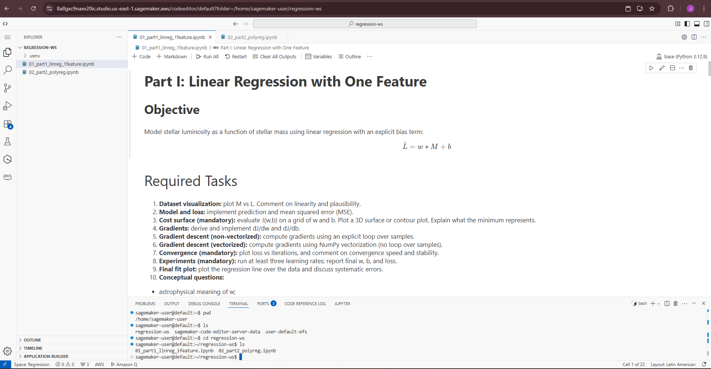
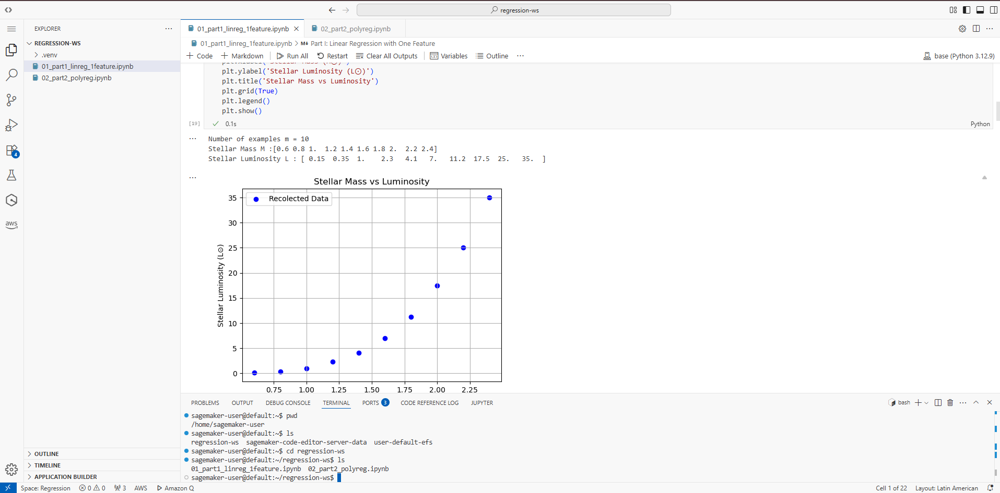
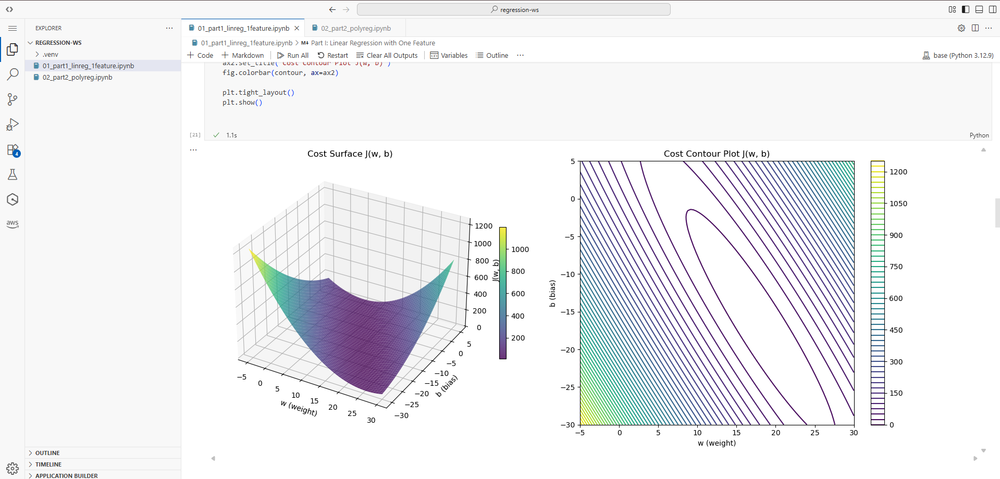
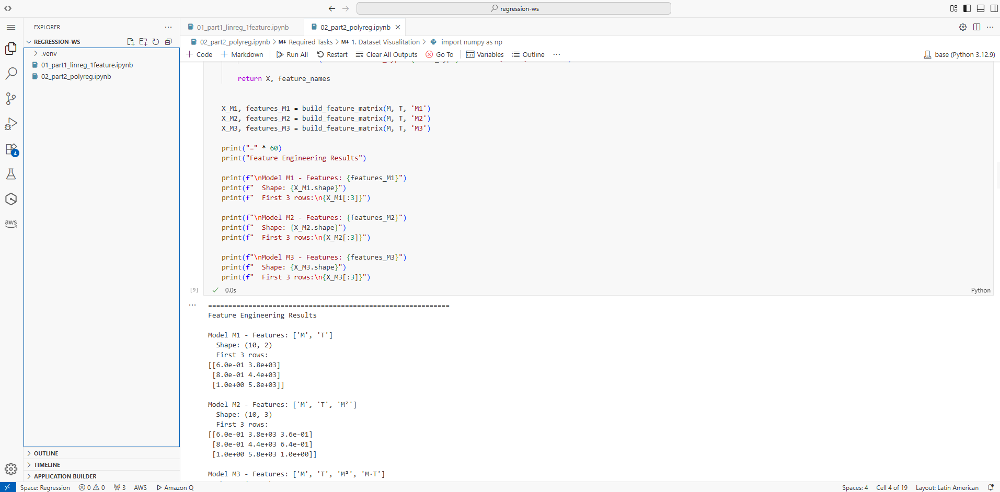
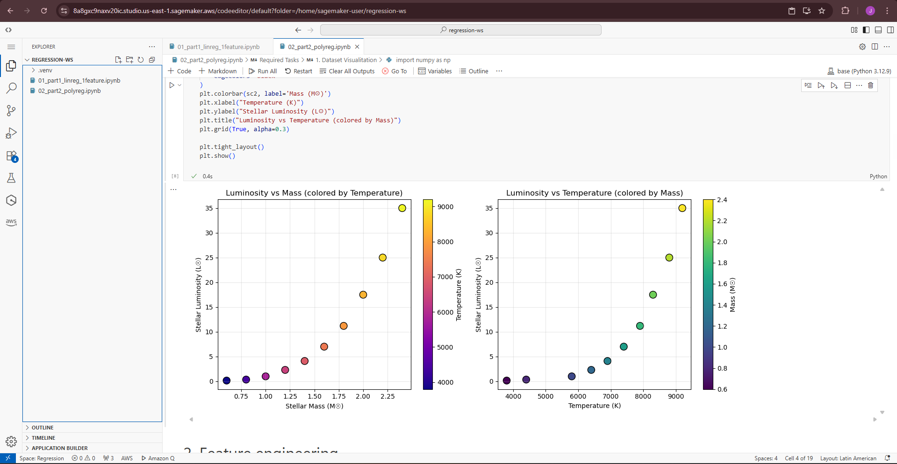

# Stellar Luminosity 
## Linear and Polynomial Models for Regression

## Introduction and Motivation

Astronomy is a data-driven science in which relationships between physical quantities are inferred and validated through observation. Classical examples include the relationships between stellar mass, temperature, radius, and luminosity. In this project, you will implement linear regression and polynomial regression from first principles, without using machine-learning libraries.

Rather than calling pre-built fitting routines, you will explicitly define the hypothesis function, the loss function, and the optimization algorithm. The astronomical problem studied here is a simplified stellar luminosity modeling task, inspired by main-sequence behavior: luminosity grows rapidly with mass, and additional properties can introduce nonlinear and interaction effects.

### Motivation for Cloud Execution and Enterprise Context

This project is part of a four-week Machine Learning Bootcamp embedded in a course on Digital Transformation and Enterprise Architecture. In this context, machine learning is treated as a core architectural capability of modern enterprise systems.

Today, intelligence is increasingly considered a first-class quality attribute alongside scalability, availability, security, and performance. Intelligent behavior is no longer confined to offline analytics; it is embedded into platforms, decision-support services, and autonomous or semi-autonomous components.

As enterprise architects, it is not sufficient to understand what models do. We must also understand how they are built from first principles, executed and validated in controlled environments, and operated within cloud platforms.

## Repository Structure

```
/
├── README.md                           # Project documentation
├── 01_part1_linreg_1feature.ipynb      # Linear Regression with one feature
└── 02_part2_polyreg.ipynb              # Polynomial Regression
```


`01_part1_linreg_1feature.ipynb` - Implements linear regression from scratch using gradient descent to model the relationship between stellar mass and luminosity.

`02_part2_polyreg.ipynb` - Extends the model to polynomial regression with two features (mass and temperature) to capture nonlinear relationships


## Dataset and Notation

| Symbol | Description | Units |
|--------|-------------|-------|
| **M** | Stellar mass | Solar mass (M⊙) |
| **T** | Effective stellar temperature | Kelvin (K) |
| **L** | Stellar luminosity | Solar luminosity (L⊙) |

### Part I Dataset (One Feature)

```python
M = [0.6, 0.8, 1.0, 1.2, 1.4, 1.6, 1.8, 2.0, 2.2, 2.4]
L = [0.15, 0.35, 1.00, 2.30, 4.10, 7.00, 11.2, 17.5, 25.0, 35.0]
```

### Part II Dataset (Two Features)

```python
M = [0.6, 0.8, 1.0, 1.2, 1.4, 1.6, 1.8, 2.0, 2.2, 2.4]
T = [3800, 4400, 5800, 6400, 6900, 7400, 7900, 8300, 8800, 9200]
L = [0.15, 0.35, 1.00, 2.30, 4.10, 7.00, 11.2, 17.5, 25.0, 35.0]
```


## ☁️ AWS SageMaker Evidence

### Upload Process

1. Accessed AWS SageMaker via the AWS Management Console.
2. Launched an existing SageMaker environment (SageMaker Studio in this case, using a workspace named *my space*).
3. Uploaded both `.ipynb` notebooks to the SageMaker environment using the built-in cloud-based code editor.
4. Selected a Python kernel with the required libraries, including NumPy and Matplotlib, to run the notebooks.


### Screenshots


#### Both notebooks visible/open in SageMaker




#### Notebook 1 in Sagemaker




#### Notebook 2 in Sagemaker





### Local vs SageMaker Execution Comparison

| Aspect | Local Execution | SageMaker Execution |
|------|----------------|---------------------|
| Environment Setup | Locally configured environment | Fully managed runtime |
| Execution Speed | Slightly slower | Generally faster |
| Plot Rendering | Inline visualization (Matplotlib) | Inline visualization (Matplotlib) |
| Observed Differences | Performance depends on local resources | Consistent performance with cloud resources |


---

## 🛠️ Technologies Used

| Technology | Purpose |
|------------|---------|
| **Python 3.8+** | Programming language |
| **NumPy** | Numerical computations, vectorization |
| **Matplotlib** | Data visualization, inline plots |
| **AWS SageMaker** | Cloud notebook execution |

---
## 🚀 How to Run

### Local Execution

```bash
# Clone the repository
git clone https://github.com/JeissonS02/Regression-and-cloud-ready-AI-infrastructure.git
cd Regression-and-cloud-ready-AI-infrastructure.git

# Install dependencies 
pip install numpy matplotlib

# Open notebooks
jupyter notebook
```

### AWS SageMaker

1. Upload `.ipynb` files to SageMaker
2. Select Python 3 kernel with NumPy/Matplotlib
3. Run all cells

---

## 👤 Author

**Jeisson David Sanchez Gomez - ECI 2026-1**


---
